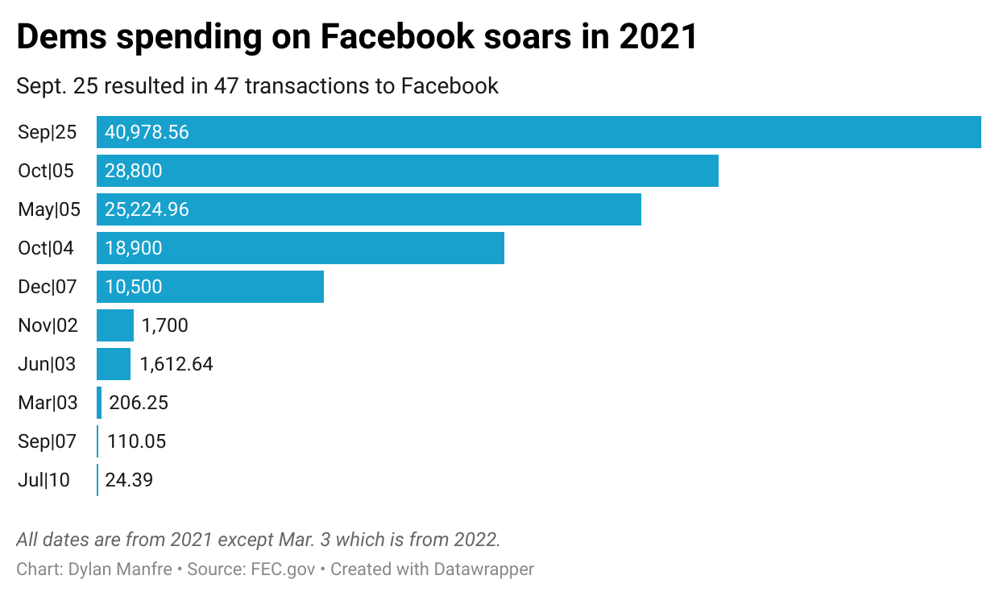

```{r setup, include=FALSE}
knitr::opts_chunk$set(echo = TRUE)

setwd("/Volumes/Elements/D-Drive/University of Maryland/Classes/Fall 2022/Data Journalism/Github Repository/Data_Journalism_2022_Fall/major_assignments/state_profile/")

```

```{r}
#libraries
library(tidyverse)
library(janitor)
library(lubridate)

```

**This section will be where I load in my datasets**
```{r}
# loading in the PA Democratic Contributions
pa_dem_contribs <- read_csv("data/pa_dem_contribs_21_22.csv")
head(pa_dem_contribs)

#laoding in GOP contribs
pa_gop_contribs <- read_csv("data/pa_gop_contribs_21_22.csv")
head(pa_gop_contribs)

#loading in Democratic Expenses
pa_dem_expenses <- read_csv("data/pa_dem_expenses_21_22.csv")
head(pa_dem_expenses)

#loading in GOP expenses
pa_gop_expenses <- read_csv("data/pa_gop_expenses_21_22.csv")
head(pa_gop_expenses)

#loading in GOP expenses
new_gop_expenses <- read_csv("data/new_gop_expenses.csv")
head(new_gop_expenses)

#loading in new_dem_expenses
new_dem_expenses <- read_csv("data/new_dem_expenses.csv")
head(new_dem_expenses)


```

**This section will be where I clean each dataset.**
**Each dataset will get its own codeblock for cleaning so that it is organized.**

```{r}
## Cleaning pa_dem_contribs


pa_dem_contribs <- pa_dem_contribs %>% 
select(-image_number, -line_number, -transaction_id, -file_number, -committee_name...9, -candidate_id, -candidate_prefix, -candidate_suffix, -candidate_office, -candidate_office_full, -candidate_office_state, -candidate_office_state_full, -candidate_office_district, -conduit_committee_id)

# renaming columns
pa_dem_contribs <- pa_dem_contribs %>% 
rename(committee_name = committee_name...2) %>% 
mutate(contribution_receipt_date = ymd(contribution_receipt_date)) %>% 
mutate(contributor_zip = str_sub(contributor_zip, start=1L, end=5L))


```

```{r}
# cleaning pa_dem_expenses

 new_dem_expenses

#cleaning up the date column.
new_dem_expenses <-  new_dem_expenses %>%
mutate(disbursement_date = as.Date(disbursement_date))


```


```{r}
# cleaning pa_gop_contribs
pa_gop_contribs <- pa_gop_contribs %>% 
select(-image_number, -line_number, -transaction_id, -file_number, -committee_name...9, -candidate_id, -candidate_prefix, -candidate_suffix, -candidate_office, -candidate_office_full, -candidate_office_state, -candidate_office_state_full, -candidate_office_district, -conduit_committee_id) %>% 
rename(committee_name = committee_name...2) %>% 
mutate(contribution_receipt_date = ymd(contribution_receipt_date)) %>% 
mutate(contributor_zip = str_sub(contributor_zip, start=1L, end=5L))


```


```{r}
#cleaning pa_gop_expenses

new_gop_expenses
#not much cleaning to do here

```


***Story time***
In order to do a complete analysis of the Pennsylvania Republican and Democratic Parties, we need to understand and learn who the major players are. Basically, we need to answer the five W’s for each party: who, what, where, when and why. This is the basic level of analysis for the two parties but we truly can go through a rabbit hole in each file.

I’ll structure it like this: I’ll write a question, then below put the code block for the answer and then write the answer out with a piece of analysis under it. Let’s start with the Democratic contributions from Pennsylvania. Money in and money out are the two most important things in a financial report. Pennsylvania as of the analysis done Nov. 27, received $14,897,061. 

```{r}
# How much did Pennsylvania raise in total.. number as of Nov. 27

total_pa_dem_contribs <- pa_dem_contribs %>% 
summarize(total_pa_dem_contribs = sum(contribution_receipt_amount))

# the result of this code is a 1x1 tibble with the total 14897061
```

It appears that Pennsylvania’s democratic party only got 15% of its overall donations from individuals which tells me that the average Joe in the state, is not pouring money into the committee. What surprised me about this was that individuals in the state gave $1,660,668 more than large political action committees did. 

```{r}
#showing how much each entity donated and breaking it down by percentage for dems
dem_entity_perc <- pa_dem_contribs %>%
group_by(entity_type, entity_type_desc) %>% 
summarize(total = sum(contribution_receipt_amount)) %>% 
mutate(perc_total = total/14897061*100) %>% 
arrange(desc(perc_total))

# showing difference between IND and PAC for Dems
ind_pac_dem_difference <- 2314694.2-654025.6
dem_entity_perc

#showing how much each entity donated and breaking it down by percentage for GOP
gop_entity_perc <- pa_gop_contribs %>%
group_by(entity_type, entity_type_desc) %>% 
summarize(total = sum(contribution_receipt_amount)) %>% 
mutate(perc_total = total/14897061*100) %>% 
arrange(desc(perc_total))

gop_entity_perc


```
Comparing the Dems to the GOP is interesting here as it shows that PACs still lags behind Individual contributors to the GOP which is noteworthy because I figured it would give more to the GOP. There is, however, a massive drop-off in the other committee category. It only makes up 2% of donations to the GOP where as the Democrats got 50% of its fundraising from that category alone.

We need to look at the top key players here. Who donated the most to Pennsylvania’s Democratic and Republican Committees and where did they come from? Are they prominent people at all? Did any one person make up a large percentage of the total donations? We’ll do this for the Republicans too.
```{r}
# Where did the GOP contribs come from.
pa_gop_contribs %>% 
group_by(contributor_name, contributor_employer) %>% 
summarize(state_total = sum(contribution_receipt_amount)) %>% 
mutate(perc_total = state_total/14897061*100) %>% 
arrange(desc(perc_total))
```
From here, we can use the same code to break this down by entity type to look at the specific individuals and analyze if they are prominent at all. In Pennsylvania, there is a limit on how much an individual can donate to a state's political committee.  The  GOP had 14 people give the maximim of $20,000 for the two year period of data that we have. The Democrats had seven people give $20,0000. I also noticed that the out-of-state contributions generated 606,577.2 and from the GOP and 1,608,492 from the Democrats.

**Say here if any of the people were prominant**
```{r}
pa_gop_contribs %>% 
filter(entity_type == "IND") %>% 
group_by(contributor_name) %>% 
summarise(total = sum(contribution_receipt_amount)) %>% 
arrange(desc(total))
#Notes: 14 people gave the maximum of $20k in the period for the GOP

pa_dem_contribs %>% 
filter(entity_type == "IND") %>% 
group_by(contributor_name, contributor_state, contributor_city) %>% 
summarise(total = sum(contribution_receipt_amount)) %>% 
arrange(desc(total))
#Notes 7 people gave the max of 20k in the period for the dem campaign.

#each_state_dem <- 
pa_dem_contribs %>% 
filter(contributor_state != "PA") %>%
filter(entity_type == "IND") %>% 
group_by(contributor_state) %>% 
summarise(total = sum(contribution_receipt_amount)) %>% 
arrange(desc(total))

each_state_dem %>% 
summarize(new_total = sum(total))

#out of state GOPs from individuals
each_state_gop<- 
pa_gop_contribs %>% 
filter(contributor_state != "PA") %>%
filter(entity_type == "IND") %>% 
group_by(contributor_state) %>% 
summarise(total = sum(contribution_receipt_amount)) %>% 
arrange(desc(total))

each_state_gop %>% 
summarize(new_total = sum(total))

```


The organizations are also impactful to this analysis 


**Put your analysis of the ORG findings here**

```{r}
# showing the orgs doners for DEMOCRATS
pa_dem_orgs <- 
pa_dem_contribs %>% 
filter(entity_type == "ORG") %>% 
group_by(contributor_name, contributor_state, contributor_zip) %>% 
summarize(total = sum(contribution_receipt_amount)) %>% 
arrange(desc(total))

pa_dem_orgs

# showing the top org doners for GOP
pa_gop_orgs <- 
pa_gop_contribs %>% 
filter(entity_type == "ORG") %>% 
group_by(contributor_name, contributor_state, contributor_zip) %>% 
summarize(total = sum(contribution_receipt_amount)) %>% 
arrange(desc(total))

pa_gop_orgs

```

Something I've found interesting is that refunds are issued. As someone who was never really knowledgeable about campaign finance, the fact that you can be issued a refund of your donation was thought-provoking. Both parties refunded a combined $14,212.96 to individual contributors.
```{r}
#looking for refunds

new_dem_expenses %>% 
group_by(disbursement_type_description) %>% 
summarize(total = sum(disbursement_amount)) %>% 
arrange(desc(total))
#203 people got refunds to individuals totaling $13,927.63

new_gop_expenses %>% 
group_by(disbursement_type_description) %>% 
summarize(total = sum(disbursement_amount)) %>% 
arrange(desc(total))
#285.33 given back to individauls for GOP.

gop_dem_total_refund <- 
  13927.63+285.33
#outputs a total of 14,212.96 
```

**Start section on analyzing the expenses*

Something important to any political campaign is advertising and I remembered when we did the unit to see if any Maryland candidates spent money on Facebook ads so I figured I'd look into that here. While it is the entire committee's spending, the Democrats spent over $128,000 on Facebook Web Ads and Facebook came up 147 times. Forty-six of those transactions came on Sept. 25, 2021. I was then curious to see what happened on that day. 

```{r}
#Viewing the chart

```


```{r}

#web_ad_spending <-
new_dem_expenses %>% 
filter(disbursement_description == "WEB ADS") %>% 
group_by(recipient_name) %>% 
summarize(total_category = sum(disbursement_amount)) %>% 
arrange(desc(total_category))

#Which date had the most quantity of facebook spending and had the most spending.
new_dem_expenses %>% 
filter(recipient_name == "FACEBOOK") %>% 
group_by(disbursement_date) %>% 
count() %>% 
arrange(desc(n))

#dem_facebook_spending <- 
new_dem_expenses %>% 
#filter(recipient_name == "FACEBOOK") %>% 
group_by(disbursement_date) %>% 
summarize(total = sum(disbursement_amount)) %>% 
arrange(desc(total))
#9/25 had 47 transactions totaling nearly $41,000

#Writing dem_facebook_spending to CSV.
write_csv(dem_facebook_spending, file = "dem_facebook_spending.csv")


new_dem_expenses %>% 
filter(disbursement_date == "2021-09-25")

```

GPS Impact was the recipient of the second most web ad spending by Democrats and according to its website, it helps Democrats win in traditionally red states.

Another super random nugget was that Cameo made an appearance on the list. Did not expect that by the politicians.


**Use this section for codes to work with before you put them in the story section will delete once I'm done with the final**
```{r}
# showing the top donors, where they're from and how much they gave in total. 
pa_dem_contribs %>%
filter(entity_type == "IND") %>% 
group_by(contributor_name, contributor_city, contributor_state) %>% 
summarise(total_contrib = sum(contribution_receipt_amount)) %>% 
arrange(desc(total_contrib))

## State ranking and % from individuals not PACs or anything?
dem_state_perc_ind <- pa_dem_contribs %>%
filter(entity_type == "IND") %>% 
group_by(contributor_state) %>% 
summarize(total = sum(contribution_receipt_amount)) %>% 
mutate(perc_total = total/14897061*100) %>% 
arrange(desc(perc_total))
### The percentages from individuals is quite small here with PA's totals making up just 15%. This tells me that the Dem committee as a whole is not getting much money from individual donations and is likely getting more from others.

#Which entity gave the most?
dem_entity_perc <- pa_dem_contribs %>%
group_by(entity_type) %>% 
summarize(total = sum(contribution_receipt_amount)) %>% 
mutate(perc_total = total/14897061*100) %>% 
arrange(desc(perc_total))
### COM makes up 50% of the donations here which is "Other committees". 

#which organization gave the most to the dem party?
pa_dem_contribs %>% 
filter(entity_type == "ORG") %>% 
group_by(contributor_name) %>% 
count() %>% 
arrange(desc(n))
  
  
#summarize(total = sum(contribution_receipt_amount)) %>% 
count()


# Which contributor gave the most out of any category... Fetterman/Schumer are key names up there. 
pa_dem_contribs %>% 
filter(entity_type == "ORG") %>% 
group_by(contributor_name) %>% 
summarize(total = sum(contribution_receipt_amount)) %>% 
arrange(desc(total))

#show me the how many times a state donated
pa_dem_contribs %>%
group_by(contributor_state) %>%
summarize(total = sum(contribution_receipt_amount)) %>% 
arrange(desc(total))


each_state %>% 
summarise(total = sum(count_contribs))


#Looking at orgs the GOP spent their money at.
new_gop_expenses %>% 
filter(entity_type_desc == "ORGANIZATION") %>% 
group_by(recipient_name) %>% 
summarize(total = sum(disbursement_amount)) %>% 
arrange(desc(total))
  
```

```{r}
each_state

```


