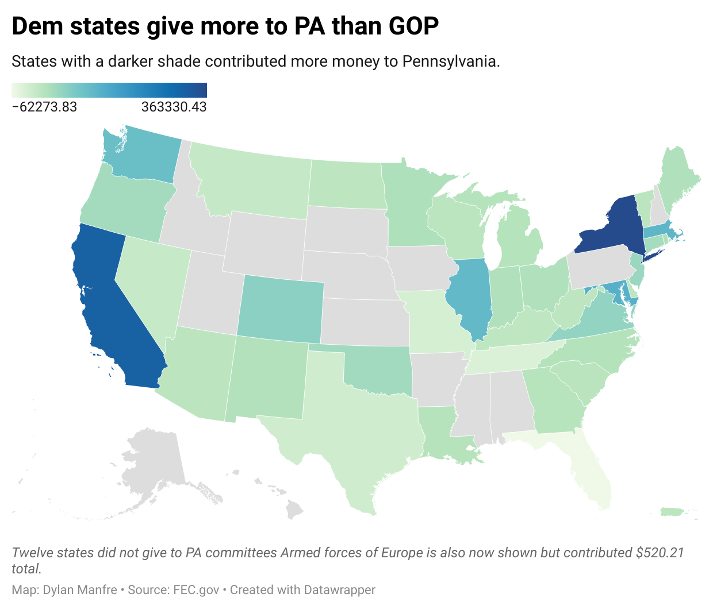

```{r setup, include=FALSE}
knitr::opts_chunk$set(echo = TRUE)

setwd("/Volumes/Elements/D-Drive/University of Maryland/Classes/Fall 2022/Data Journalism/Github Repository/Data_Journalism_2022_Fall/major_assignments/state_profile/")

```

```{r}
#libraries
library(tidyverse)
library(janitor)
library(lubridate)

```

**This section will be where I load in my datasets**
```{r}
# loading in the PA Democratic Contributions
pa_dem_contribs <- read_csv("data/updated_pa_dem_contribs.csv")
head(pa_dem_contribs)

#laoding in GOP contribs
pa_gop_contribs <- read_csv("data/updated_pa_gop_contribs.csv")
head(pa_gop_contribs)

#loading in Democratic Expenses
pa_dem_expenses <- read_csv("data/updated_pa_dem_expenses.csv")
head(pa_dem_expenses)

#loading in GOP expenses
pa_gop_expenses <- read_csv("data/updated_pa_gop_expenses.csv")
head(pa_gop_expenses)
```


```{r}
#done after open refine

#loading in GOP expenses
new_gop_expenses <- read_csv("data/updated_pa_gop_expenses.csv")
head(new_gop_expenses)

#loading in new_dem_expenses
new_dem_expenses <- read_csv("data/updated_pa_dem_expenses.csv")
head(new_dem_expenses)
```

**This section will be where I clean each dataset.**
**Each dataset will get its own codeblock for cleaning so that it is organized.**

```{r}
## Cleaning pa_dem_contribs


pa_dem_contribs <- pa_dem_contribs %>% 
select(-image_number, -line_number, -transaction_id, -file_number, -committee_name...9, -candidate_id, -candidate_prefix, -candidate_suffix, -candidate_office, -candidate_office_full, -candidate_office_state, -candidate_office_state_full, -candidate_office_district, -conduit_committee_id)

# renaming columns
pa_dem_contribs <- pa_dem_contribs %>% 
rename(committee_name = committee_name...2) %>% 
mutate(contribution_receipt_date = ymd(contribution_receipt_date)) %>% 
mutate(contributor_zip = str_sub(contributor_zip, start=1L, end=5L))


```

```{r}
# cleaning pa_dem_expenses

 new_dem_expenses

#cleaning up the date column.
new_dem_expenses <-  new_dem_expenses %>%
mutate(disbursement_date = as.Date(disbursement_date))


```


```{r}
# cleaning pa_gop_contribs
pa_gop_contribs <- pa_gop_contribs %>% 
select(-image_number, -line_number, -transaction_id, -file_number, -committee_name...9, -candidate_id, -candidate_prefix, -candidate_suffix, -candidate_office, -candidate_office_full, -candidate_office_state, -candidate_office_state_full, -candidate_office_district, -conduit_committee_id) %>% 
rename(committee_name = committee_name...2) %>% 
mutate(contribution_receipt_date = ymd(contribution_receipt_date)) %>% 
mutate(contributor_zip = str_sub(contributor_zip, start=1L, end=5L))


```


```{r}
#cleaning pa_gop_expenses

new_gop_expenses <- new_gop_expenses %>% 
mutate(disbursement_date = as.Date(disbursement_date))


```


 ***Story time***
In order to do a complete analysis of the Pennsylvania Republican and Democratic Parties, we need to understand and learn who the major players are. Basically, we need to answer the five W’s for each party: who, what, where, when and why. This is the basic level of analysis for the two parties but we truly can go through a rabbit hole in each file.

I’ll structure it like this: I’ll write a question, then below put the code block for the answer and then write the answer out with a piece of analysis under it. Let’s start with the Democratic contributions from Pennsylvania. Money in and money out are the two most important things in a financial report. Pennsylvania as of the analysis done Nov. 27, received $14,897,061. As of Dec. 12, that number jumped to $17,665,854.

```{r}
# How much did Pennsylvania raise in total.. number as of Oct. 19

total_pa_dem_contribs <- pa_dem_contribs %>% 
summarize(total_pa_dem_contribs = sum(contribution_receipt_amount))

total_pa_dem_contribs
# the result of this code is a 1x1 tibble with the total 17,665,854 for Dems

total_pa_gop_contribs <- pa_gop_contribs %>% 
summarize(total_pa_gop_contribs = sum(contribution_receipt_amount))
# the result of this code is a 1x1 tibble with the total 7,620,215 for GOP

total_pa_gop_contribs

```

It appears that Pennsylvania’s democratic party  got 21% of its overall donations from individuals which tells me that the average Joe in the state, is not pouring money into the committee. This is actually up from 15% when I first loaded data into this markdown. What surprised me about this was that individuals in the state gave $204,629.20 more than large political action committees did. 

The GOP's percentages are a bit ore stark in my opinion. Roughly 8% of its donations come from PACs. I figured that it would be at least a million.

```{r}
#showing how much each entity donated and breaking it down by percentage for dems
dem_entity_perc <- 
pa_dem_contribs %>%
group_by(entity_type, entity_type_desc) %>% 
summarize(total = sum(contribution_receipt_amount)) %>% 
mutate(perc_total = total/17665854*100) %>% 
arrange(desc(perc_total))

dem_entity_perc

# showing difference between IND and PAC for Dems
ind_pac_dem_difference <- 3173876.1-877326.7

#showing how much each entity donated and breaking it down by percentage for GOP
gop_entity_perc <- pa_gop_contribs %>%
group_by(entity_type, entity_type_desc) %>% 
summarize(total = sum(contribution_receipt_amount)) %>% 
mutate(perc_total = total/7620215*100) %>% 
arrange(desc(perc_total))

gop_entity_perc


```
Comparing the Dems to the GOP is interesting here as it shows that PACs still lags behind Individual contributors to the GOP which is noteworthy because I figured it would give more to the GOP. There is, however, a massive drop-off in the other committee category. It only makes up 2% of donations to the GOP where as the Democrats got 50% of its fundraising from that category alone.

We need to look at the top key players here. Who donated the most to Pennsylvania’s Democratic and Republican Committees and where did they come from? Are they prominent people at all? Did any one person make up a large percentage of the total donations? We’ll do this for the Republicans too.

The Fetterman Campaign donated around 8% of the total contributions and was the highest totaling contributor among the candidates in PA. "CHRIS DELUZIO VICTORY FUND" was the second highest contributor associated to a candidate.

```{r}
# What committees did the GOP contribs come from
pa_gop_contribs %>% 
filter(entity_type == "COM") %>% 
group_by(contributor_name, contributor_employer) %>% 
summarize(state_total = sum(contribution_receipt_amount)) %>% 
mutate(perc_total = state_total/5965924*100) %>% 
arrange(desc(perc_total))

pa_dem_contribs %>% 
filter(entity_type == "COM") %>% 
group_by(contributor_name, contributor_employer) %>% 
summarize(state_total = sum(contribution_receipt_amount)) %>% 
mutate(perc_total = state_total/17665854*100) %>% 
arrange(desc(perc_total))


```

From here, we can use the same code to break this down by entity type to look at the specific individuals and analyze if they are prominent at all. In Pennsylvania, there is a limit on how much an individual can donate to a state's political committee.  The  GOP had 15 people give the max of $20,000 for the two year period of data that we have. The Democrats had seven people give $20,0000. I also noticed that the out-of-state contributions generated $692,355.90 and from the GOP and $2,172,204 from the Democrats.

A lot of the top GOP donors are high-ranking individuals within their own sectors. We see a handful of chairman and Presidents of various companies. Those individuals are the ones who gave the max $20,000. The majority of the GOP donors are retired people. 

```{r}
pa_gop_contribs

pa_gop_contribs %>% 
filter(entity_type == "IND") %>% 
group_by(contributor_name, contributor_occupation) %>% 
summarise(total = sum(contribution_receipt_amount)) %>% 
arrange(desc(total))
#Notes: 15 people gave the maximum of $20k in the period for the GOP

pa_dem_contribs %>% 
filter(entity_type == "IND") %>% 
group_by(contributor_name, contributor_occupation, contributor_state, contributor_city, ) %>% 
summarise(total = sum(contribution_receipt_amount)) %>% 
arrange(desc(total))
#Notes 7 people gave the max of 20k in the period for the dem campaign.

each_state_dem <- pa_dem_contribs %>% 
filter(contributor_state != "PA") %>%
filter(entity_type == "IND") %>% 
group_by(contributor_state) %>% 
summarise(total = sum(contribution_receipt_amount)) %>% 
arrange(desc(total))

each_state_dem %>% 
summarize(new_total = sum(total))

#out of state GOPs from individuals
each_state_gop<- 
pa_gop_contribs %>% 
filter(contributor_state != "PA") %>%
filter(entity_type == "IND") %>% 
group_by(contributor_state) %>% 
summarise(total = sum(contribution_receipt_amount)) %>% 
arrange(desc(total))

each_state_gop %>% 
summarize(new_total = sum(total))
```


When we are looking at the out of state contributions I thought it was interesting that not every committee receives donations from each state. So here I created a map showing the states that gave the most to Pennsylvania with some missing. Thirty-nine outside states gave to Pennsylvania Dems and 23 states contributed to PA's GOP committee. The out of state contributions are significant because it shows that the parties are able to generate funding outside of its local base.
```{r}

#joining each states dem and GOP
joined_out_of_state <- each_state_dem %>%
  left_join(each_state_gop, by = "contributor_state")

#renaming
joined_out_of_state <- joined_out_of_state %>% 
rename(dem = "total.x") %>% 
rename(gop = "total.y")

## do the replace NA function with 0s
joined_out_of_state <- joined_out_of_state %>%
  mutate(gop = ifelse(is.na(gop), 0, gop))

#generating the state_diff column
joined_out_of_state <-  joined_out_of_state %>% 
mutate(state_diff = dem-gop)

# writing to CSV
write_csv(joined_out_of_state, file = "joined_out_of_state.csv")

#Viewing the chart


```


VLM COOPERATIVE, INC was an interesting company that gave the Dems money because there was so little information on them. When looking at the orgs that contributed to the GOP, I noticed that most of them are located in PA where as orgs from various states gave to the Democratic party.

```{r}
# showing the orgs doners for DEMOCRATS
pa_dem_orgs <- 
pa_dem_contribs %>% 
filter(entity_type == "ORG") %>% 
group_by(contributor_name, contributor_state, contributor_zip) %>% 
summarize(total = sum(contribution_receipt_amount)) %>% 
arrange(desc(total))

pa_dem_orgs

# showing the top org doners for GOP
pa_gop_orgs <- 
pa_gop_contribs %>% 
filter(entity_type == "ORG") %>% 
group_by(contributor_name, contributor_state, contributor_zip) %>% 
summarize(total = sum(contribution_receipt_amount)) %>% 
arrange(desc(total))

pa_gop_orgs

```

Something I've found interesting is that refunds are issued. As someone who was never really knowledgeable about campaign finance, the fact that you can be issued a refund of your donation was thought-provoking. Both parties refunded a combined $14,212.96 to individual contributors.

I believe this could possibly be a story only because people usually give to a campaign with the intention that the money will be used for something but in these cases, the money was refunded.
```{r}
#looking for refunds

new_dem_expenses %>% 
group_by(disbursement_type_description) %>% 
summarize(total = sum(disbursement_amount)) %>% 
arrange(desc(total))
#203 people got refunds to individuals totaling $13,927.63

new_gop_expenses %>% 
group_by(disbursement_type_description) %>% 
summarize(total = sum(disbursement_amount)) %>% 
arrange(desc(total))
#285.33 given back to individauls for GOP.

gop_dem_total_refund <- 
  13927.63+285.33
#outputs a total of 14,212.96 
```

**Start section on analyzing the expenses*

Something important to any political campaign is advertising and I remembered when we did the unit to see if any Maryland candidates spent money on Facebook ads so I figured I'd look into that here. While it is the entire committee's spending, the Democrats spent over $128,000 on Facebook Web Ads. Forty-six of those transactions came on Sept. 25, 2021. I was then curious to see what happened on that day. After we loaded in the new data which went up to Oct. 19, there were no new transactions to Facebook. When I looked at the Meta Ad library and saw the Democratic ads, I did not see anything too jarring in terms of what was actually said in the ads.

They didn't necessarily attack or cast aspersions any one candidate in particular like we've seen with some GOP ads.

```{r}
#Viewing the chart
knitr::include_graphics("data/facebook_spending.png")
```


```{r}

#web_ad_spending_dems <-
new_dem_expenses %>% 
filter(disbursement_description == "WEB ADS") %>% 
group_by(recipient_name) %>% 
summarize(total_category = sum(disbursement_amount)) %>% 
arrange(desc(total_category))
#shows 128k spent on Facebook 

#web_ad_spending_gop <-
new_gop_expenses %>% 
filter(disbursement_description == "WEB ADS") %>% 
group_by(recipient_name) %>% 
summarize(total_category = sum(disbursement_amount)) %>% 
arrange(desc(total_category))
#shows 120k spent on Facebook 

#Which date had the most quantity of facebook spending and had the most spending.
new_dem_expenses %>% 
filter(recipient_name == "FACEBOOK") %>% 
group_by(disbursement_date) %>% 
count() %>% 
arrange(desc(n))

dem_facebook_spending <- 
new_dem_expenses %>% 
filter(recipient_name == "FACEBOOK") %>% 
group_by(disbursement_date) %>% 
summarize(total = sum(disbursement_amount)) %>% 
arrange(desc(total))
#9/25 had 47 transactions totaling nearly $41,000

#Writing dem_facebook_spending to CSV.
write_csv(dem_facebook_spending, file = "dem_facebook_spending.csv")


new_dem_expenses %>% 
filter(disbursement_date == "2021-09-25")

```

GPS Impact was the recipient of the second most web ad spending by Democrats and according to its website, it helps Democrats win in traditionally red states. They target all types of audiences in hopes to increase the Democratic message.

Another super random nugget was that Cameo made an appearance on the list. I did not expect that by the politicians and now I'm curious which politicians from the PA Democratic Party appeared on the platform. A total of 1677.38 was spent on Cameo by the Democrats on two dates, 12/08/21 and 10/04/21.

There is potential for a story here. I"m very curious to see who made the Cameo appearance. After looking at PADems on Instagram, I saw that Julia Louis Dreyfus was in a post that had the language of a Cameo so it was unclear if this is what the Cameo dollers went to. 

```{r}
#Filtering to see when transctions to Cameo were made.
pa_dem_expenses %>% 
filter(recipient_name == "CAMEO") %>% 
group_by(disbursement_date) %>% 
summarize(total = sum(disbursement_amount))

1204.88+472.50

```


**Use this section for codes to work with before you put them in the story section will delete once I'm done with the final**
```{r}
# showing the top donors, where they're from and how much they gave in total. 
pa_dem_contribs %>%
filter(entity_type == "IND") %>% 
group_by(contributor_name, contributor_city, contributor_state) %>% 
summarise(total_contrib = sum(contribution_receipt_amount)) %>% 
arrange(desc(total_contrib))

## State ranking and % from individuals not PACs or anything?
dem_state_perc_ind <- pa_dem_contribs %>%
filter(entity_type == "IND") %>% 
group_by(contributor_state) %>% 
summarize(total = sum(contribution_receipt_amount)) %>% 
mutate(perc_total = total/14897061*100) %>% 
arrange(desc(perc_total))
### The percentages from individuals is quite small here with PA's totals making up just 15%. This tells me that the Dem committee as a whole is not getting much money from individual donations and is likely getting more from others.

#Which entity gave the most?
dem_entity_perc <-pa_dem_contribs %>%
group_by(entity_type) %>% 
summarize(total = sum(contribution_receipt_amount)) %>% 
mutate(perc_total = total/14897061*100) %>% 
arrange(desc(perc_total))
### COM makes up 50% of the donations here which is "Other committees". 

#which organization gave the most to the dem party?
pa_dem_contribs %>% 
filter(entity_type == "ORG") %>% 
group_by(contributor_name) %>% 
count() %>% 
arrange(desc(n))
  
  
#summarize(total = sum(contribution_receipt_amount)) %>% 
count()


# Which contributor gave the most out of any category... Fetterman/Schumer are key names up there. 
pa_dem_contribs %>% 
filter(entity_type == "ORG") %>% 
group_by(contributor_name) %>% 
summarize(total = sum(contribution_receipt_amount)) %>% 
arrange(desc(total))

#show me the how many times a state donated
pa_dem_contribs %>%
group_by(contributor_state) %>%
summarize(total = sum(contribution_receipt_amount)) %>% 
arrange(desc(total))


#Looking at orgs the GOP spent their money at.
new_gop_expenses %>% 
filter(entity_type_desc == "ORGANIZATION") %>% 
group_by(recipient_name) %>% 
summarize(total = sum(disbursement_amount)) %>% 
arrange(desc(total))
  


```


practice codes with new data
```{r}

pa_dem_contribs %>% 
filter(entity_type == "ORG") %>% 
group_by(contributor_name) %>% 
summarize(total = sum(contribution_receipt_amount)) %>% 
arrange(desc(total))

pa_dem_contribs %>% 
filter(entity_type == "ORG") %>% 
group_by(contributor_name) %>% 
summarize(total = sum(contribution_receipt_amount)) %>% 
arrange(desc(total))


new_gop_expenses %>% 
group_by(disbursement_description) %>% 
count() %>% 
arrange(desc(n))
```


```{r}
# removing the data frames in enviornment

rm(list = c("blair", "blair_22", "blair_contribs_2018", "blair_contribs_2022", "blair_elrich", "blair_elrich_18", "blair_elrich_22", "blair_expenses_2018", "blair_expenses_2022", "counties", "elrich", "elrich_22", "elrich_contribs", "elrich_contribs_2022", "elrich_contribs_2018", "elrich_expenses_2018", "elrich_expenses_2022", "md_actblue_zip", "md_counties", "md_counties_joined", "md_county_population", "md_gov_county", "md_voters_per_10k", "moco_boundaries", "moco_precincts", "primary_22", "pg_turnout", "top_blair_2022_contribs", "top_blair_contribs_18", "top_elrich_contribs_18", "top_elrich_contribs_22", "voters_by_county" ))

rm(list = c("moco_prec_2022"))

rm(list = c("each_state"))
```


```{r}


```


